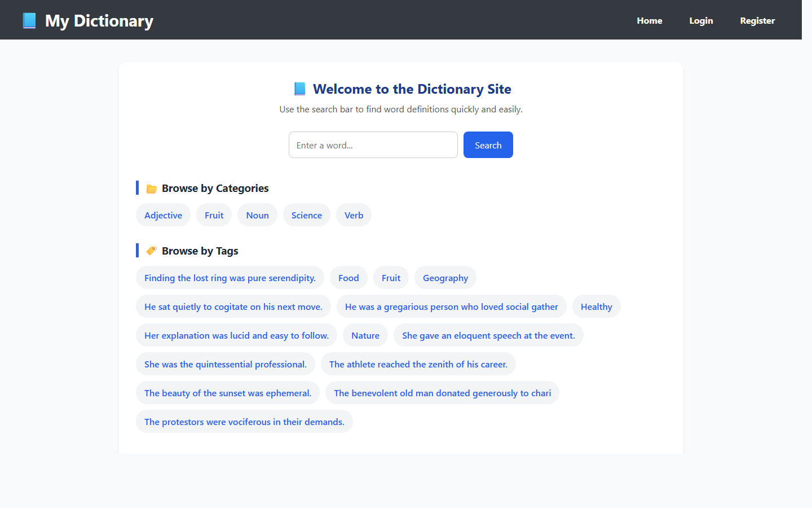
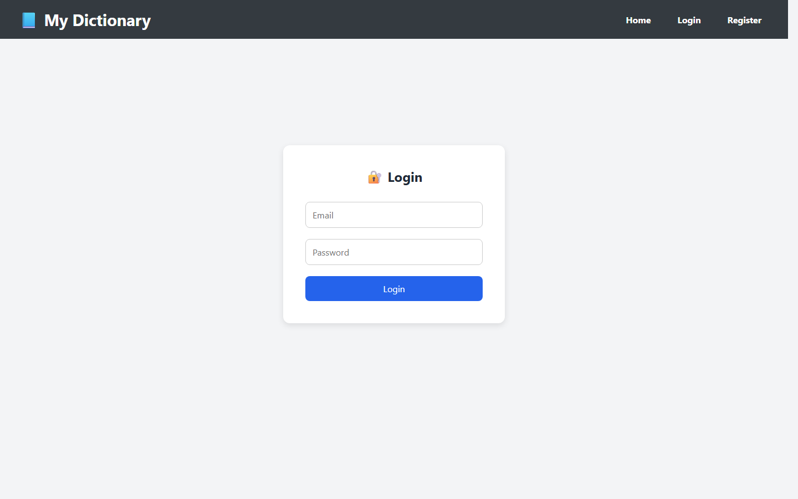
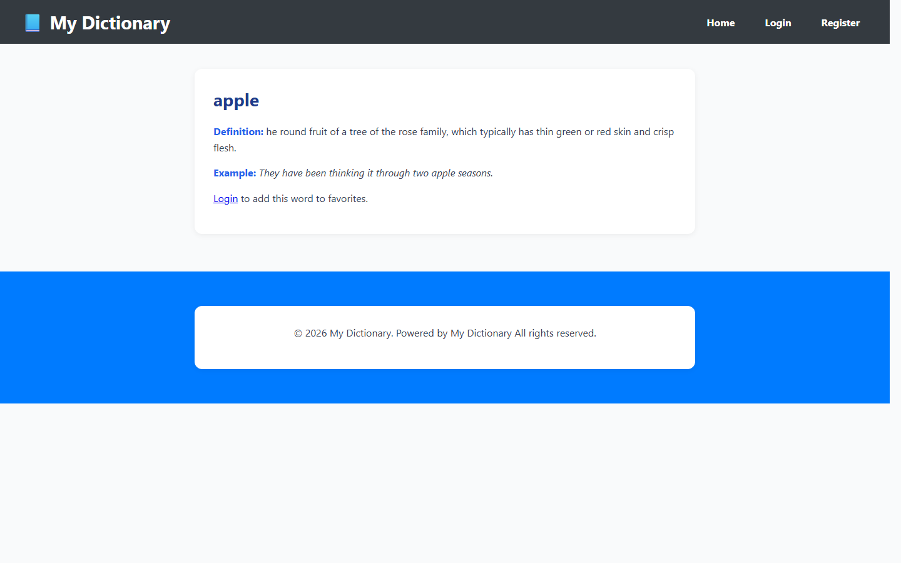
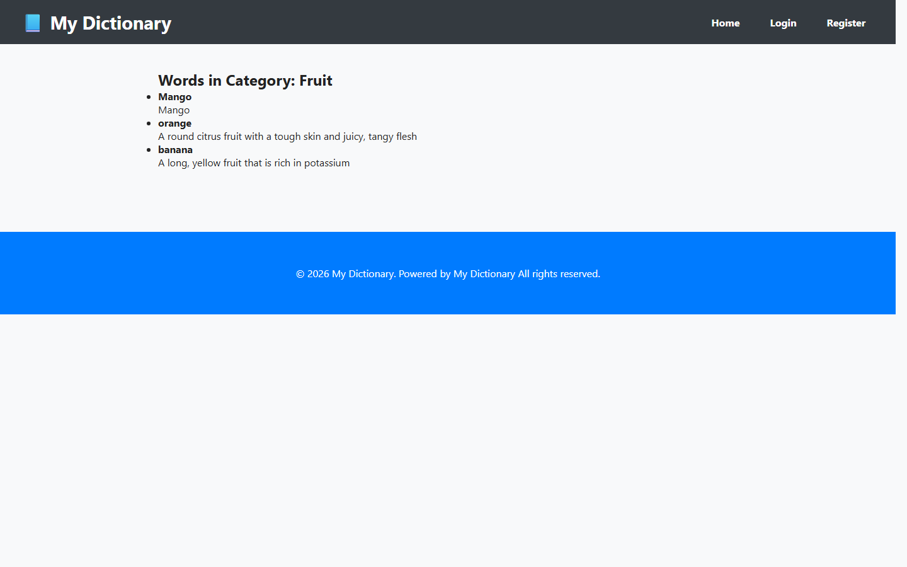
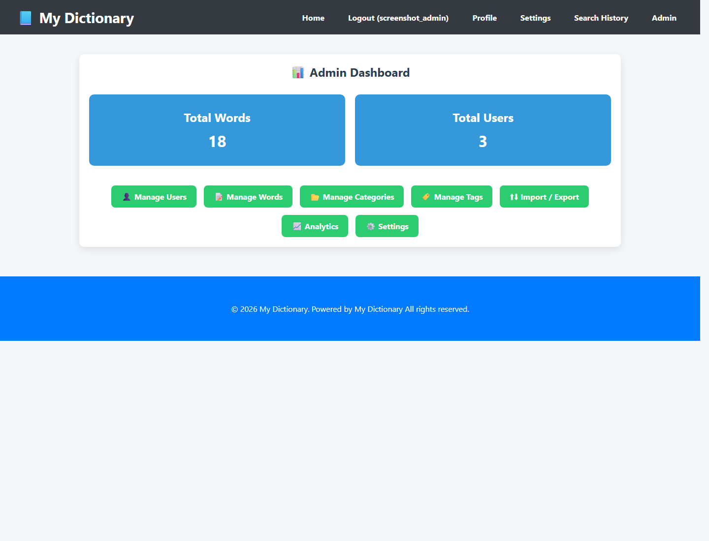
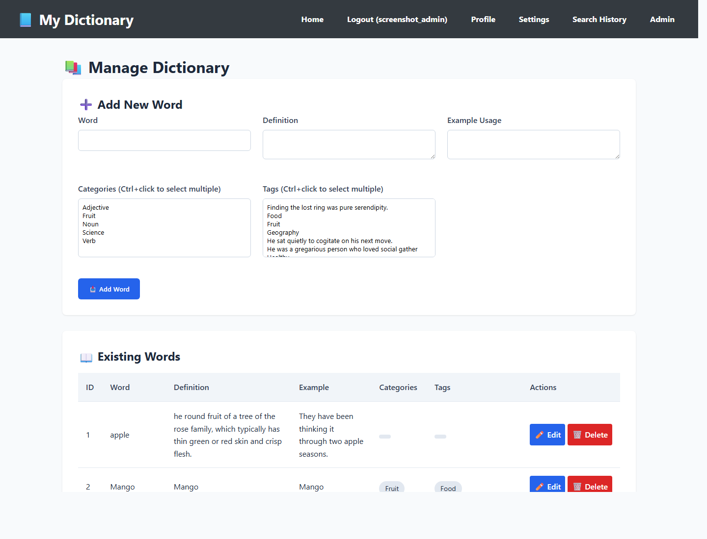
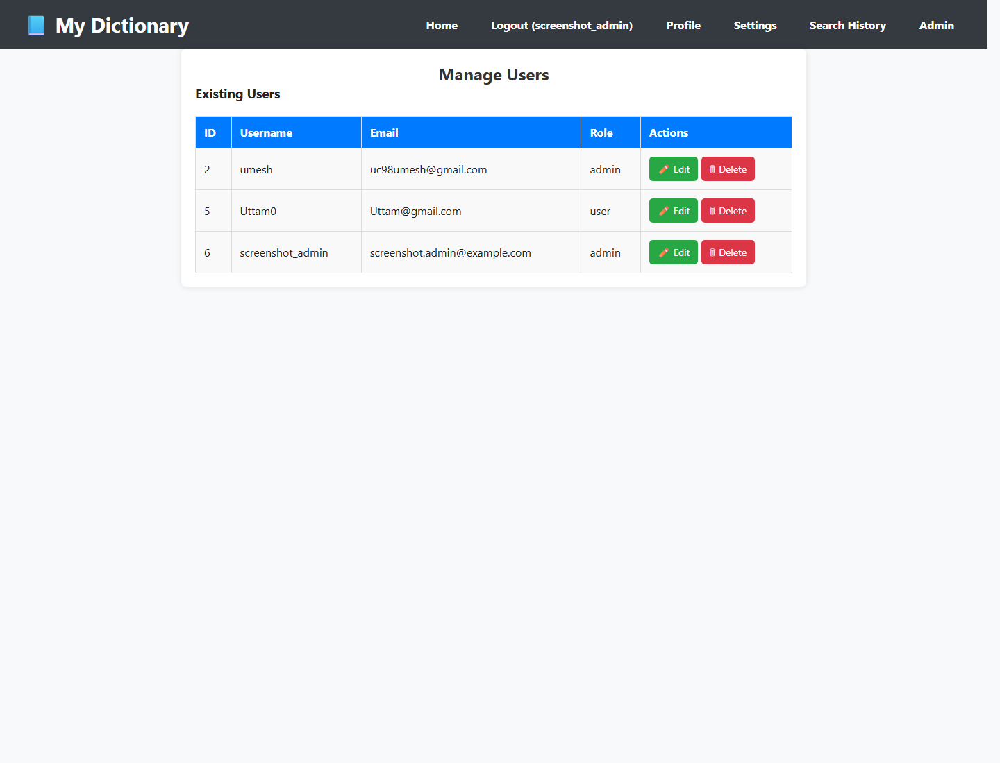
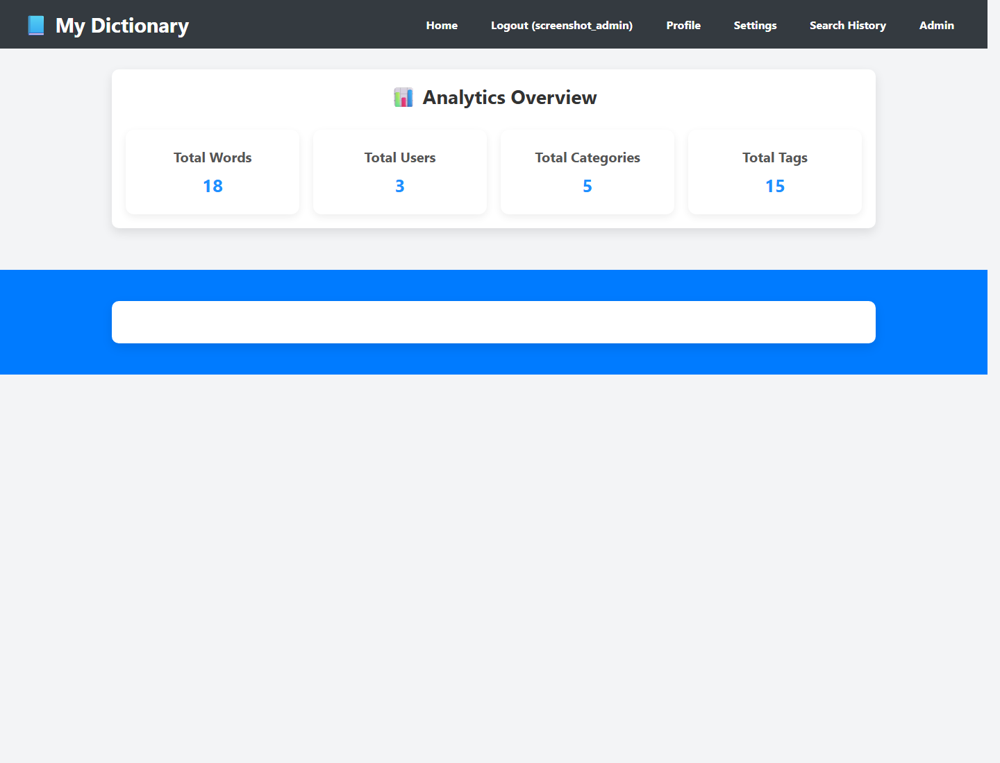

# Dictionary Management System

A PHP and MySQL based web application for searching dictionary words, browsing by category or tag, and managing dictionary content through a separate admin panel.

## Features

- User registration, login, logout, and session-based access control
- Role-based access for admin and standard users
- Word search and detailed word pages with definitions and example usage
- Category and tag browsing for organized dictionary navigation
- Favorites and search history for logged-in users
- Admin dashboard with basic analytics
- CRUD management for words, categories, tags, and users
- CSV import and export for dictionary data
- Profile update and password change pages

## Tech Stack

- PHP
- MySQL
- HTML
- CSS
- JavaScript
- XAMPP / Apache

## Screenshots

### Public Pages

### Home Page



### Login Page



### Word Detail Page



### Category Page



### Admin Pages

| Admin Dashboard | Manage Words |
| --- | --- |
|  |  |

| Manage Users | Analytics |
| --- | --- |
|  |  |

## Project Structure

```text
admin/      Admin dashboard and management pages
assets/     CSS, JavaScript, and images
includes/   Shared PHP config and helper files
sql/        Database schema and sample SQL files
uploads/    Imported CSV files
user/       User profile, favorites, history, and settings pages
```

## Local Setup

1. Clone the repository.
2. Move the project folder into your XAMPP `htdocs` directory.
3. Create a MySQL database named `dictionary_db`.
4. Import the schema from `sql/schema.sql`.
5. Update database settings in `includes/config.php` if needed.
6. Start Apache and MySQL in XAMPP.
7. Open `http://localhost/dictionary-site/` in your browser.

## Main Modules

- Public dictionary browsing
- User account management
- Favorites and search history
- Admin content management
- CSV import/export
- Basic analytics and site settings
